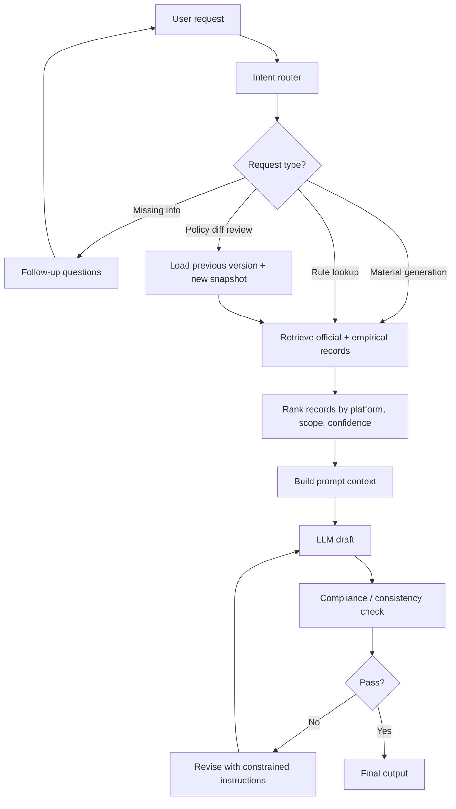

# AI Material Harness and Prompt Suite Draft

This document turns the notes in `You hit the nail on the head.md` into a practical, policy-grounded system for AI-assisted material generation.

The design has two layers:

1. A harness that routes each request, fetches the right evidence, and keeps unverified claims isolated.
2. A prompt suite that converts those inputs into usable material without letting the model invent missing facts.

## 1. Data Model

Use three buckets instead of one blended knowledge base:

| Bucket | Purpose | Example |
| :--- | :--- | :--- |
| Official | Stable source of truth | Platform policy, help center, product docs |
| Empirical | Observed behavior or tested patterns | A/B tests, creator experiments, internal monitoring |
| Unverified | Candidate rules that still need confirmation | A scraped claim, a heuristic, a community tip |

Each record should carry:

- `source_type`
- `source_url`
- `captured_at`
- `last_verified_at`
- `confidence`
- `scope`
- `platform`
- `rule_text`
- `diff_from_previous`

## 2. Harness Flow



### What each stage does

1. **Intent router** -> Classifies whether the user wants material generation, rule extraction, policy diffing, or a compliance review.
   * 💡 *Meaningful Impact:* Prevents the model from taking the wrong branch and generating the wrong kind of output.

2. **Follow-up questions** -> Asks only the minimum questions needed to remove ambiguity.
   * 💡 *Meaningful Impact:* Keeps the system from overfitting to a guessed user intent.

3. **Record retrieval** -> Pulls the most relevant official and empirical entries for the requested platform and content type.
   * 💡 *Meaningful Impact:* Gives the model grounded evidence instead of a vague policy blob.

4. **Ranking and filtering** -> Prefers official rules, then high-confidence empirical records, then low-confidence candidates.
   * 💡 *Meaningful Impact:* Unverified claims stay visible but do not silently override better sources.

5. **Prompt assembly** -> Converts the selected records into a strict context bundle.
   * 💡 *Meaningful Impact:* Makes the model operate on a stable schema rather than free-form notes.

6. **Draft generation** -> Produces the first version of the material.
   * 💡 *Meaningful Impact:* Separates creative output from validation so each step has a single job.

7. **Compliance check** -> Verifies the draft against the selected rules and flags unresolved conflicts.
   * 💡 *Meaningful Impact:* Reduces hallucinated claims and catches missing constraints before release.

8. **Revision loop** -> Re-prompts the model only with the specific issues that failed validation.
   * 💡 *Meaningful Impact:* Fixes the minimum surface area instead of regenerating everything.

9. **Final output** -> Returns the approved material plus a short evidence summary.
   * 💡 *Meaningful Impact:* Users can see what was used and why the result is trustworthy.

## 3. Follow-Up Questions

Use these when the request is underspecified.

1. What is the output type: caption, script, post, ad copy, or policy summary?
2. Which platform or audience should the material target?
3. Do you want a creative draft, a compliance-safe rewrite, or a rule extraction report?
4. Should the result prefer official rules, empirical observations, or a blend of both?
5. Do you want the model to preserve voice, or is it allowed to rewrite aggressively?

## 4. Prompt Suite

### 4.1 Router Prompt

```text
You are a request router for an AI material system.

Classify the user request into exactly one of these modes:
- material_generation
- compliance_rewrite
- policy_diff_review
- rule_extraction
- follow_up_needed

If the request is missing a critical field, return follow_up_needed and list the minimum questions needed.
Do not generate the final material in this step.

Output JSON only.
```

### 4.2 Retrieval Prompt

```text
You are selecting grounding records for a content generation task.

Use only the supplied database entries. Rank them by:
1. platform match
2. scope match
3. confidence
4. recency

Mark each record as one of:
- official
- empirical
- unverified

Return a compact evidence bundle with the top records and the reason each one was selected.
```

### 4.3 Drafting Prompt

```text
You are an AI writing assistant.

Task:
Create a usable draft based only on the context bundle below.

Rules:
- Do not invent policy facts.
- Do not promote unverified claims as facts.
- Preserve the requested tone.
- If the evidence is weak, say so and keep the output conservative.

Output:
1. Draft
2. Short rationale
3. Any assumptions used
```

### 4.4 Compliance Check Prompt

```text
You are a strict validator.

Compare the draft against the provided rules and evidence.

Return:
- pass / fail
- violated rules
- missing evidence
- exact revision instructions

If the draft contains unsupported claims, mark fail.
If the draft is compliant but weak, mark pass with a note.
```

### 4.5 Revision Prompt

```text
You are revising a draft after validation.

Only fix the listed issues.
Do not rewrite unrelated sections.
Do not add new claims.

Return the corrected version only.
```

## 5. Suggested JSON Record Shape

```json
{
  "platform": "Xiaohongshu",
  "rule_id": "XHS_RULE_001",
  "source_type": "official",
  "source_url": "https://example.com/policy",
  "captured_at": "2026-07-21T00:00:00Z",
  "last_verified_at": "2026-07-21T00:00:00Z",
  "confidence": 0.98,
  "scope": "caption",
  "rule_text": "Avoid unsupported claims in promotional copy.",
  "diff_from_previous": "No change",
  "notes": "Stable policy reference"
}
```

## 6. Practical Recommendation

Start with the harness first, then add the prompt suite.

- The harness gives you routing, evidence selection, and follow-up questions.
- The prompt suite gives you generation, validation, and revision.

That order matters because a strong prompt cannot compensate for weak retrieval or unclear intent.